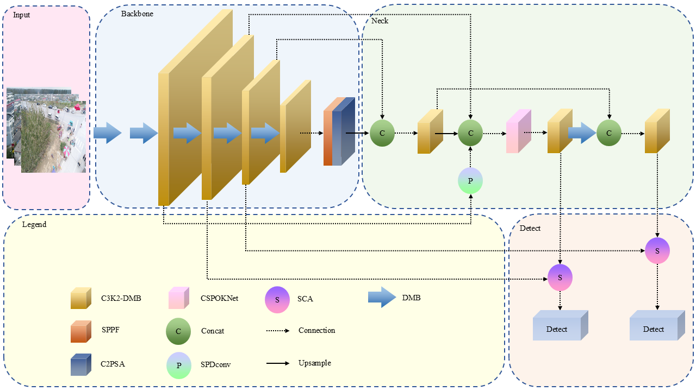

Paper:
DFS-YOLO: Prior-Guided Dynamic Feature Enhancement and Context-Aware Fusion for Small Object Detection in UAV Imagery
Yu Chen, Chen Zhang, Zhongliang Denga, Zhaoyu Liu, Heng Yang, Xinling Wen, Yuxin Qin, Duanyang Zhong and Wenliang Lin.

